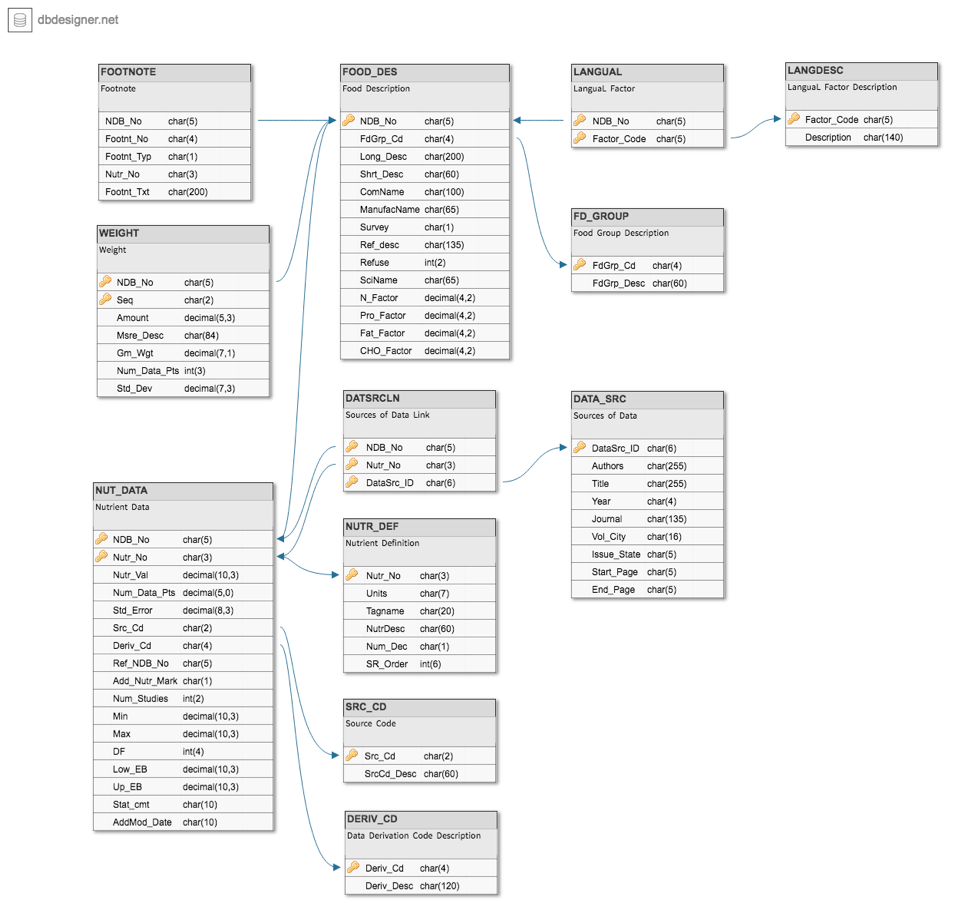

# USDAFoodPopulator For CockroachDB

This project helps demonstrate how to import CSV data into CockroachDB. Below lies all of the information 
necessary to create the database.

## Schema

Database reference image:



Database table-schema:

```sql
CREATE TABLE data_src (
 datasrc_id STRING(6) NOT NULL,
 authors STRING(255) NULL,
 title STRING(255) NOT NULL,
 year STRING(4) NULL,
 journal STRING(135) NULL,
 vol_city STRING(16) NULL,
 issue_state STRING(5) NULL,
 start_page STRING(5) NULL,
 end_page STRING(5) NULL,
 CONSTRAINT "primary" PRIMARY KEY (datasrc_id ASC),
 FAMILY "primary" (datasrc_id, authors, title, year, journal, vol_city, issue_state, start_page, end_page)
);

CREATE TABLE fd_group (
 fdgrp_cd STRING(4) NOT NULL,
 fdgrp_desc STRING(60) NOT NULL,
 CONSTRAINT "primary" PRIMARY KEY (fdgrp_cd ASC),
 FAMILY "primary" (fdgrp_cd, fdgrp_desc)
);

CREATE TABLE food_des (
 ndb_no STRING(5) NOT NULL,
 fdgrp_cd STRING(4) NOT NULL,
 long_desc STRING(200) NOT NULL,
 shrt_desc STRING(60) NOT NULL,
 comname STRING(100) NULL,
 manufacname STRING(65) NULL,
 survey STRING(1) NULL,
 ref_desc STRING(135) NULL,
 refuse INT NULL,
 sciname STRING(65) NULL,
 n_factor DECIMAL(4,2) NULL,
 pro_factor DECIMAL(4,2) NULL,
 fat_factor DECIMAL(4,2) NULL,
 cho_factor DECIMAL(4,2) NULL,
 CONSTRAINT "primary" PRIMARY KEY (ndb_no ASC),
 CONSTRAINT fk__food_des__fd_group FOREIGN KEY (fdgrp_cd) REFERENCES fd_group (fdgrp_cd),
 INDEX food_des_auto_index_fk__food_des__fd_group (fdgrp_cd ASC),
 FAMILY "primary" (ndb_no, fdgrp_cd, long_desc, shrt_desc, comname, manufacname, survey, ref_desc, refuse, sciname, n_factor, pro_factor, fat_factor, cho_factor)
);

CREATE TABLE nutr_def (
 nutr_no STRING(3) NOT NULL,
 units STRING(7) NOT NULL,
 tagname STRING(20) NULL,
 nutrdesc STRING(60) NOT NULL,
 num_dec STRING(1) NOT NULL,
 sr_order INT NOT NULL,
 CONSTRAINT "primary" PRIMARY KEY (nutr_no ASC),
 FAMILY "primary" (nutr_no, units, tagname, nutrdesc, num_dec, sr_order)
);

CREATE TABLE src_cd (
 src_cd STRING(2) NOT NULL,
 srccd_desc STRING(60) NOT NULL,
 CONSTRAINT "primary" PRIMARY KEY (src_cd ASC),
 FAMILY "primary" (src_cd, srccd_desc)
);

CREATE TABLE deriv_cd (
 deriv_cd STRING(4) NOT NULL,
 deriv_desc STRING(120) NOT NULL,
 CONSTRAINT "primary" PRIMARY KEY (deriv_cd ASC),
 FAMILY "primary" (deriv_cd, deriv_desc)
);

CREATE TABLE nut_data (
 ndb_no STRING(5) NOT NULL,
 nutr_no STRING(3) NOT NULL,
 nutr_val DECIMAL(10,3) NOT NULL,
 num_data_pts DECIMAL(5) NOT NULL,
 std_error DECIMAL(8,3) NULL,
 src_cd STRING(2) NOT NULL,
 deriv_cd STRING(4) NULL,
 ref_ndb_no STRING(5) NULL,
 add_nutr_mark STRING(1) NULL,
 num_studies INT NULL,
 min DECIMAL(10,3) NULL,
 max DECIMAL(10,3) NULL,
 df INT NULL,
 low_eb DECIMAL(10,3) NULL,
 up_eb DECIMAL(10,3) NULL,
 stat_cmt STRING(10) NULL,
 addmod_date STRING(10) NULL,
 CONSTRAINT "primary" PRIMARY KEY (ndb_no ASC, nutr_no ASC),
 CONSTRAINT fk__nut_data__nutr_def FOREIGN KEY (nutr_no) REFERENCES nutr_def (nutr_no),
 INDEX nut_data_auto_index_fk__nut_data__nutr_def (nutr_no ASC),
 CONSTRAINT fk__nut_data__src_cd FOREIGN KEY (src_cd) REFERENCES src_cd (src_cd),
 INDEX nut_data_auto_index_fk__nut_data__src_cd (src_cd ASC),
 CONSTRAINT fk__nut_data__deriv_cd FOREIGN KEY (deriv_cd) REFERENCES deriv_cd (deriv_cd),
 INDEX nut_data_auto_index_fk__nut_data__deriv_cd (deriv_cd ASC),
 CONSTRAINT fk__nut_data__food_des FOREIGN KEY (ndb_no) REFERENCES food_des (ndb_no),
 FAMILY "primary" (ndb_no, nutr_no, nutr_val, num_data_pts, std_error, src_cd, deriv_cd, ref_ndb_no, add_nutr_mark, num_studies, min, max, df, low_eb, up_eb, stat_cmt, addmod_date)
);

CREATE TABLE datsrcln (
 ndb_no STRING(5) NOT NULL,
 nutr_no STRING(3) NOT NULL,
 datasrc_id STRING(6) NOT NULL,
 CONSTRAINT "primary" PRIMARY KEY (ndb_no ASC, nutr_no ASC, datasrc_id ASC),
 CONSTRAINT fk__datsrcln__data_src FOREIGN KEY (datasrc_id) REFERENCES data_src (datasrc_id),
 INDEX datsrcln_auto_index_fk__datsrcln__data_src (datasrc_id ASC),
 CONSTRAINT fk__datsrcln__nut_data FOREIGN KEY (ndb_no, nutr_no) REFERENCES nut_data (ndb_no, nutr_no),
 FAMILY "primary" (ndb_no, nutr_no, datasrc_id)
);

CREATE TABLE langdesc (
 factor_code STRING(5) NOT NULL,
 description STRING(140) NOT NULL,
 CONSTRAINT "primary" PRIMARY KEY (factor_code ASC),
 FAMILY "primary" (factor_code, description)
);

CREATE TABLE langual (
 ndb_no STRING(5) NOT NULL,
 factor_code STRING(5) NOT NULL,
 CONSTRAINT "primary" PRIMARY KEY (ndb_no ASC, factor_code ASC),
 FAMILY "primary" (ndb_no, factor_code)
);

CREATE TABLE weight (
 ndb_no STRING(5) NOT NULL,
 seq STRING(2) NOT NULL,
 amount DECIMAL(6,3) NOT NULL,
 msre_desc STRING(84) NOT NULL,
 gm_wgt DECIMAL(7,1) NOT NULL,
 num_data_pts INT NULL,
 std_dev DECIMAL(7,3) NULL,
 CONSTRAINT "primary" PRIMARY KEY (ndb_no ASC, seq ASC),
 CONSTRAINT fk__weight__food_des FOREIGN KEY (ndb_no) REFERENCES food_des (ndb_no),
 FAMILY "primary" (ndb_no, seq, amount, msre_desc, gm_wgt, num_data_pts, std_dev)
);

```

